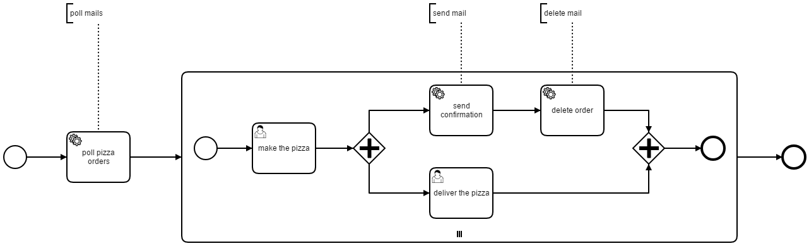

# camunda-bpm-mail - example - pizza order

This example demonstrate how to 

* poll mails from server,
* send a mail with generated text body,
* delete an existing mail



## How to run it

1. Build the WAR using Maven `mvn install`
2. Download a [Camunda Distribution](https://camunda.org/download/)
3. Copy the WAR `camunda-bpm-mail.example.pizza-${VERSION}.war` into the webapps / deployments folder
4. Copy the JAR `camunda-bpm-mail-core-${VERSION}.jar` into the application server lib folder (and make sure that the required dependencies are available - like JavaMail 1.5.5) (e.g. tomcat folder: `server\apache-tomcat-8.0.24\lib`)
5. Copy the mail configuration `src/main/resources/mail-configuration.properties` to application server config folder and adjust it (e.g. tomcat folder: `server\apache-tomcat-8.0.24\conf`)
6. Set the environment variable `MAIL_CONFIG` to the path where you copied the mail configuration
7. Start the application server 
8. Send a mail which contains the pizza order as text body (i.e. pizza funghi)
9. Open the Tasklist and start an instance of the process 'pizzaOrderProcess'
10. Check that a user task is created - complete it
11. Now, check your mails and assert that the order mail is deleted

### Run it as JUnit test

You can also use the [ProcessIntegrationTest](src/test/java/org/camunda/bpm/extension/mail/example/ProcessIntegrationTest.java) to run the example as a JUnit test with an embedded process engine.

## How it works

### Poll Mails

When the process starts, it polls the mails with the pizza orders using the `mail-poll` connector. The mails are stored in the process variable `mails`.

```xml
<bpmn:serviceTask id="ServiceTask_1hayaw5" name="poll pizza orders">
  <bpmn:extensionElements>
    <camunda:connector>
      <camunda:inputOutput>
        <camunda:outputParameter name="mails">${mails}</camunda:outputParameter>
      </camunda:inputOutput>
      <camunda:connectorId>mail-poll</camunda:connectorId>
    </camunda:connector>
  </bpmn:extensionElements>
  <!-- ... -->
</bpmn:serviceTask>
```

The following subprocess iterates over the mails and creates one execution for each mail to process it.

### Send a Mail

When the pizza is made (i.e. complete user task 'make the pizza'), the process send a confirmation mail using the `mail-send` connector. The body of the mail is generated via FreeMarker template.

```xml
<bpmn:serviceTask id="ServiceTask_00zf1ut" name="send confirmation">
  <bpmn:extensionElements>
    <camunda:connector>
      <camunda:inputOutput>
        <camunda:inputParameter name="to">${mail.getFrom()}</camunda:inputParameter>
        <camunda:inputParameter name="subject"><![CDATA[${'RE: '.concat(mail.getSubject())}]]></camunda:inputParameter>
        <camunda:inputParameter name="text">
          <camunda:script scriptFormat="freemarker"><![CDATA[Hello, your pizza is ready and will be delivered soon.

           Order:
           ${mail.getText()} 

           Cheers!]]></camunda:script>
        </camunda:inputParameter>
      </camunda:inputOutput>
      <camunda:connectorId>mail-send</camunda:connectorId>
    </camunda:connector>
  </bpmn:extensionElements>
  <!-- ... -->
</bpmn:serviceTask>
```

### Delete a Mail

Since the order is processed, the mail is deleted using the `mail-delete` connector.

```xml
<bpmn:serviceTask id="ServiceTask_0vs8d6x" name="delete order">
  <bpmn:extensionElements>
    <camunda:connector>
      <camunda:inputOutput>
        <camunda:inputParameter name="mails">
          <camunda:list>
            <camunda:value>${mail}</camunda:value>
          </camunda:list>
        </camunda:inputParameter>
      </camunda:inputOutput>
      <camunda:connectorId>mail-delete</camunda:connectorId>
    </camunda:connector>
  </bpmn:extensionElements>
  <!-- ... -->
</bpmn:serviceTask>
```
