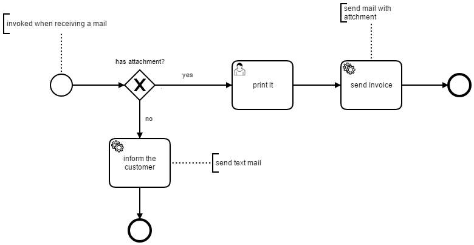

# camunda-bpm-mail - example - print service

This example demonstrate how to 

* use the `MailNotificationService` to get informed while receive a new mail,
* send a mail with an attached file



## How to run it

1. Build the WAR using Maven `mvn install`
2. Download a [Camunda Distribution](https://camunda.org/download/)
3. Copy the WAR `camunda-bpm-mail.example.print-service-${VERSION}.war` into the webapps / deployments folder
4. Copy the JAR `camunda-bpm-mail-core-${VERSION}.jar` into the application server lib folder  (and make sure that the required dependencies are available - like JavaMail 1.5.5)
5. Copy the mail configuration `src/main/resources/mail-configuration.properties` to application server config folder and adjust it
6. Set the environment variable `MAIL_CONFIG` to the path where you copied the mail configuration
7. Start the application server 
8. Send a mail with the attached file which should be printed
9. Check that a user task is created - complete it
10. Now, check your mails

Also try to send a mail without attachment.

### Run it as JUnit test

You can also use the [ProcessIntegrationTest](src/test/java/org/camunda/bpm/extension/mail/example/ProcessIntegrationTest.java) to run the example as a JUnit test with an embedded process engine.

## How it works

### Using the MailNotificationService

Create an instance of the `MailNotificationService`, register the handler and start the service. When a new print order is received via mail, the service invokes the handler which starts the process and pass the received mail into it as process variable.

```java
configuration = MailConfigurationFactory.getConfiguration();
notificationService = new MailNotificationService(configuration);

notificationService.registerMailHandler(mail -> {
  runtimeService.startProcessInstanceByKey("printProcess",
    Variables.createVariables()
      .putValue("mail", mail)
      .putValue("invoice", getInvoicePath()));
});

notificationService.start();
```

### Send a Mail with Attachment

When the order is processed (i.e. complete user task 'print it') then the process sends a mail with the attached invoice (`invoice.pdf`) using the `mail-send` connector. The path of the invoice is stored in the process variable `invoice`.

```xml
<bpmn:serviceTask id="ServiceTask_1ry54cw" name="send invoice">
  <bpmn:extensionElements>
    <camunda:connector>
      <camunda:inputOutput>
        <camunda:inputParameter name="to">${mail.getFrom()}</camunda:inputParameter>
        <camunda:inputParameter name="subject">invoice</camunda:inputParameter>
        <camunda:inputParameter name="fileNames">
          <camunda:list>
            <camunda:value>${invoice}</camunda:value>
          </camunda:list>
        </camunda:inputParameter>
      </camunda:inputOutput>
      <camunda:connectorId>mail-send</camunda:connectorId>
    </camunda:connector>
  </bpmn:extensionElements>
  <!-- ... -->
</bpmn:serviceTask>
```

